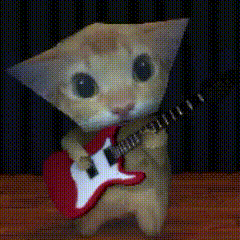
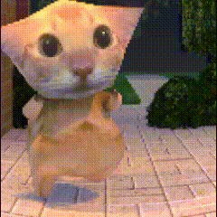
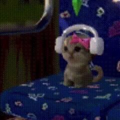
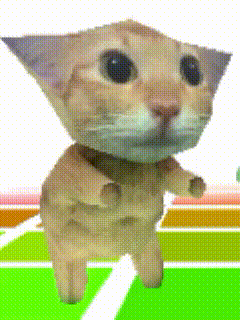

# Hi, I'm Liu Yuheng

I am an undergraduate student interested in computer engineering, digital systems, FPGA development, embedded systems, CAD, 3D Gaussian Splatting, and practical software engineering.

  
  
  
  

## About Me

- Student at ZJU-UIUC Institute
- Interested in FPGA design, embedded systems, computer architecture, and software engineering
- Currently learning CAD-related topics, 3D Gaussian Splatting, and 3D reconstruction workflows
- Currently working on course projects, lab assignments, and personal engineering experiments

## Tech Stack

`C` `C++` `Python` `SystemVerilog` `Verilog` `FPGA` `Quartus` `Nios II` `CAD` `3D Gaussian Splatting` `Git` `Linux`

## Contact

- GitHub: [ChArLiEdance](https://github.com/ChArLiEdance)
